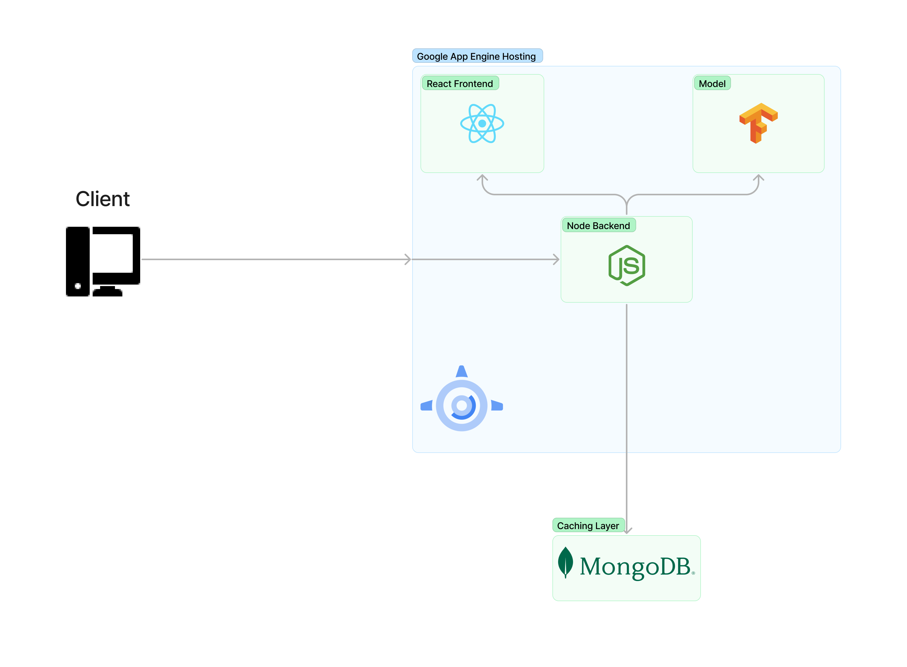

# LSTM Weather System Design Document

## Deployment

### Design Diagram



### CI/CD

The CI/CD pipeline for this project was made using Github actions. Every time a pull request was merged into the main branch it would trigger an upload to Google Cloud App engine. The code would be built and then all incoming server traffic would be routed to the newly created version. Details can be found in the [YAML file](link to that YAML file corresponding with the CI/CD)
Google App Engine: Technology choice overview
Despite deployment being done in Google Cloud Platform, the cloud architecture was designed using the AWS Well-Architected Framework. Deployment on Google App Engine was highly optimized for the pillars:

- Operational excellence - Google App Engine features an extensive management system that has led to extremely quick error diagnosis and general operations management.
- Security - Google has some of the best security practices in the industry and includes extensive documentation on how to implement highly secure systems using their technology.
- Reliability - Google App Engine has a 99.95% uptime and can withstand multiple data center failures. This level of reliability is more than enough for our program.
- Performance efficiency - Since Google App Engine is a Platform-As-A-Service the CI/CD flow was highly optimized compared to more advanced systems that would be overkill for our application. In addition it is much simpler to use than AWS and Azure equivalents.
- Cost optimization - Google Cloud’s generous free tier allows us to run this app without incurring any costs.
- Sustainability - Google Cloud’s commitment to [sustainability](https://cloud.google.com/sustainability) along with our app having a relatively quick time-out speed allows us to have minimal environmental impact.

## Language Choices

### TypeScript: Technology choice overview

We found TypeScript to be the obvious choice for our overall language. Considering that we were sending data between a front and back end we needed careful type checking to ensure that there were no mistakes in the formatting of the data. Using TypeScript permitted us this careful type checking while also giving us the flexibility that is provided by JavaScript and access to the enormous amount of packages that are available through npm.

## Frontend

### React: Technology choice overview

We choose to use a React frontend for a few reasons. Primarily, that was the frontend framework that we were the most familiar with. However, it also very easily compiles to static html and gives us the freedom to use a completely seperate backend. It also permitted us to create a relatively small and simple frontend that would load quickly to accomodate for our rather slow hosting server. Finally, the useState hook made it increadibly easy to give simple default and overridable values for the data until the api responds with the most recent prediction.

### Frontend Design Summary

We used create react app to get a very simple react project that we modified from there. We used that default file structure in combination with some minor modifications required to set up a router as to permit an error 404 page. While we originally used Axios to fetch our data from the backend we switched to using fetch to retrieve the data, as fetch allows for fetching from relative paths.

### Reactive Design

We took into account the many kinds of devices that may be viewing our website, so we handwrote css that was designed mainly for desktop and laptop screens, but that still was visually appealing on mobile and tablet screens without losing any of the data. While manually writing CSS would never be our first inclination, we chose to do it ourselves instead of using some kind of framework because of the compass that shows the difference between the actual and predicted data. The compass would require manual styling regardless, so we decided it would be better to fully self-style instead of mixing some kind of framework with our own styling.

## Backend

### NodeJS: Technology choice overview

The decision to use NodeJS was not one taken lightly. While it is capable of handling a significant amount of concurrent requests, it struggles at CPU-intensive tasks such as calling the prediction function on the model. However NodeJS became the obvious choice after discussion of the [caching layer](#caching-layer-summary)
, which reduces the amount of times that we will need to do CPU intensive tasks, and the large support surrounding the runtime environment. This support allowed an easy export/import of the model to the server that would only be possible in another Python-based web application. We did not end up using a Python-based server due to the advantages in concurrent requests that are available in NodeJS.

### ExpressJS: Technology choice overview

Using Express was another easy choice as it would integrate easily with our react frontend, and would permit a more appealing structure for routing. Express was also benefitial for how well documented it is as we wanted our primary focus to go towards making the actual predtive algorithm work instead of creating some kind of hyper complex backend system. The simplicity and reliability of Express made it an easy choice.

### MongoDB: Technology choice overview

MongoDB is not traditionally used as a caching layer. However, the flexibility, cost, and simplicity made this an obvious choice. If we had used a database that enforces strict schema and wanted to add more labels to the model while preserving historical predictions, we would have to modify the entire database. Using this technology allows us to change the schema of the database incredibly easily. In addition, Typescript enforces an interface for the data that was going to be uploaded to the database, which reduces the weakness associated with the flexibility.
In terms of the cost, most relational databases are associated with high running costs when compared with MongoDBs generous free tier.
The massive community associated with the MongoDB-NodeJS connection allowed for incredible online resources and a simple API which massively decreased development time.
Redis, which is the classic caching database, only allows key-value pairs which does not allow us to have an entire prediction set contained within one document. We could have, theoretically, enforced a naming schema by adding some index to the key (predicted_wind_1), but this increases the potential for errors and the amount of database queries needed to accomplish the same task.

### Caching Layer Summary

While NodeJS is very good at handling high volumes of requests, it can struggle to cope with a combination of high request volume and computationally-intensive tasks. Since calculating predictions based on an RNN model can be somewhat demanding on the system, we opted to add a caching layer that will prevent multiple requests within the same reporting-window (the weather station we are pulling data from reports data hourly) from triggering a prediction event. Every request to the server triggers a call to MongoDB to see if a prediction has been made within the last 60 minutes. If one has been made, it is sent to the user with no third-party API calls or model prediction calls. If a prediction has not been made, the server calls the model and the third-party API to send these values to the user. Then these values are pushed to the database as a document containing the actual and predicted weather values.

## Machine Learning

### Goals

While the model for this project certainly could have been much larger, the goal was to experiment with the accuracy of a simple RNN.

### Model Architecture

The simple RNN used for prediction in this project was defined using a single LSTM layer containing 32 units and a dense layer containing 3 units corresponding with the 3 labels, Wx, Wy, and Temperature:

```python
lstm_model = tf.keras.models.Sequential([
    tf.keras.layers.LSTM(32, return_sequences=True),
    tf.keras.layers.Dense(units=3)
])
```

### Data

The data for training was sourced from [NOAA](https://www.ncei.noaa.gov/access). The data displayed on the user interface is sourced from [aviationweather.gov](aviationweather.gov). While both sources pull data from the same ASOS weather station located at the Charles M. Schultz Airport, some values found in the NOAA database seem unrealistic for the weather patterns associated with the airport. This may have led to accuracy issues between the displayed weather data and the predicted weather data. It highlights the importance of data quality when building models such as these.
